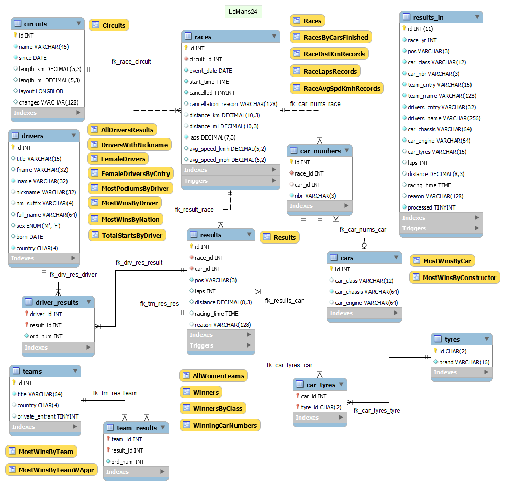

# LeMans24

A schema with 24 Hours of Le Mans endurance race results including all races, drivers, teams and cars to be used for statistics.

# Contents

## Model

The database model is maintained with the help of [MySQL Workbench](https://www.mysql.com/products/workbench/) and has the following objectives:

* elimination of data redundancy;
* data access (through primary and foreign key, indexes);
* ensuring data integrity and accuracy.

The model is in file [lemans24.mwb](db/model/lemans24.mwb) and is graphically represented here below.

## Tables

* `car_numbers`    - Car numbers per race
* `car_tyres`      - Tyres per car
* `cars`           - Cars register
* `circuits`       - Circuits register (to track changes in Circuit de la Sarthe length and configuration)
* `driver_results` - Connects drivers to results
* `drivers`        - Drivers register
* `races`          - Races register (including cancelled)
* `results`        - Results register
* `results_in`     - Results input buffer
* `team_results`   - Connects teams to results
* `teams`          - Teams register
* `tyres`          - Tyre brands

## Triggers

* `races_calc_laps_bi`   - Calculates laps from distance and circuit length
* `races_calc_laps_bu`   - Calculates laps from distance and circuit length
* `results_checks_bi`    - Checks position values
* `results_checks_bu`    - Checks position values
* `results_in_checks_bi` - Checks input data
* `results_in_checks_bu` - Checks input data

## Views

* `Circuits`             - List circuits length and changes per years
* `RaceAvgSpdKmhRecords` - Average speed in km/h records
* `RaceDistKmRecords`    - Distance in km records
* `RaceLapsRecords`      - Total number of laps records
* `Races`                - List races with distance in km and mi, laps, average speed in km/h and mi/h
* `Results`              - Reconstruct results from different tables (used for verification of processing)

# Routines

* `check_position`  - Checks position for number, NC, DNF, DNS, DSQ values
* `cleanup`         - Cleans up tables `driver_results`, `team_results`, `results`, `car_tyres`, `car_numbers`, `cars`, `drivers`, `teams`, resets `AUTO_INCREMENT` and marks all records in table `results_in` as not processed
* `process_results` - Processes results from `results_in` into tables `cars`, `car_numbers`, `car_tyres`, `results`, `teams`, `team_results`, `drivers` and `driver_results`. Sets the record in `results_in` as processed

# TODO

Add statistics over the new result tables.

# Licenses

This code and data model in this sample project is available under GPL v2 license.
Data source is Wikipedia, so data is under CC BY-SA 3.0 license.
