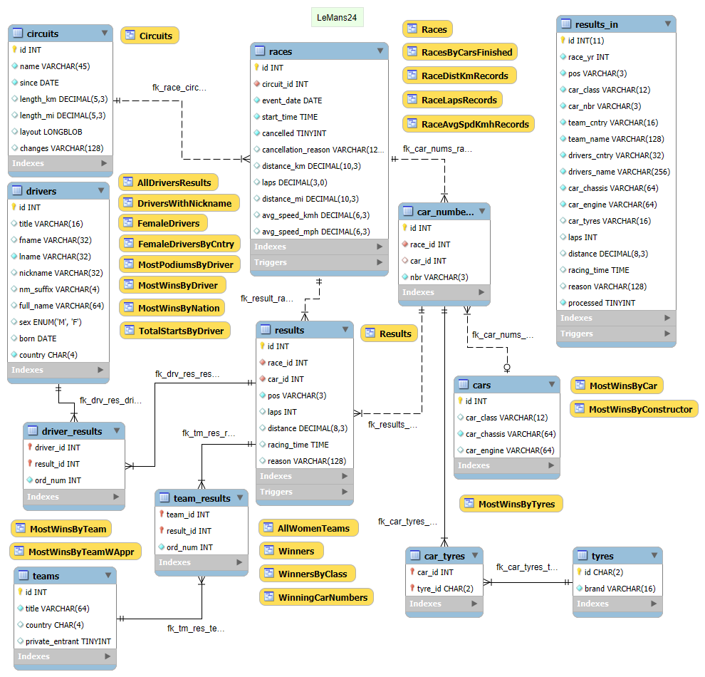

# LeMans24

A schema with 24 Hours of Le Mans endurance race results including all races,
drivers, teams and cars to be used for statistics.

## How to use

In order to use the project you need to do either of the following:

### Option 1 - Using [MySQL Workbench](https://www.mysql.com/products/workbench/):

1. Create database structure:
  - Open [lemans24.mwb](db/model/lemans24.mwb) in MySQL Workbench;
  - From the _Database_ menu choose
  [Forward Engineer](https://dev.mysql.com/doc/workbench/en/wb-forward-engineering-live-server.html);
  - Follow the wizard and generate the database on your MySQL instance.

_Note_: You could also use
[Forward Engineer SQL CREATE Script](https://dev.mysql.com/doc/workbench/en/wb-forward-engineering-sql-scripts.html)
to generate SQL script.

2. Import data:
  - In MySQL Workbench's Navigator select table `circuits`;
  - Right click and select _Table Data Import Wizard_;
  - Select file `db/data/circuits.csv` and click _Next_;
  - You have to adjust column names and skip colum `id`;
  - Then, repeat the same for files `db/data/races.csv` and
  `db/data/results_in.csv` for the respective tables;
  - Finally, execute script `db/data/tyres.sql`.
3. Load data:
  - To get structured data populated in the database tables execute procedure
  `process_results` with `call process_results();`.

_Remark_: For faster performance disable
[autocommit](https://dev.mysql.com/doc/refman/8.0/en/innodb-autocommit-commit-rollback.html)
for the execution of the procedure.

### Option 2 - Using pre-generated SQL scripts:

1. Get the schema creation script [lemans24.sql](db/model/lemans24.sql);
2. Get the data dump [lemans24-data.sql](db/data/lemans24-data.sql);
3. Import the two scripts in the same order with either `mysql` command-line
  client (see
  [Executing SQL Statements from a Text File](https://dev.mysql.com/doc/refman/8.0/en/mysql-batch-commands.html))
  or with [MySQL Shell](https://dev.mysql.com/doc/mysql-shell/8.0/en/).

# Contents

## Model

The database model is maintained with the help of
[MySQL Workbench](https://www.mysql.com/products/workbench/) and has
the following objectives:

* elimination of data redundancy;
* data access (through primary and foreign key, indexes);
* ensuring data integrity and accuracy.

The model is in file [lemans24.mwb](db/model/lemans24.mwb) and is
graphically represented here below.

## Tables

* `car_numbers`    - Car numbers per race;
* `car_tyres`      - Tyres per car;
* `cars`           - Cars register;
* `circuits`       - Circuits register (to track changes in Circuit
  de la Sarthe length and configuration);
* `driver_results` - Connects drivers to results;
* `drivers`        - Drivers register;
* `races`          - Races register (including cancelled);
* `results`        - Results register;
* `results_in`     - Results input buffer;
* `team_results`   - Connects teams to results;
* `teams`          - Teams register;
* `tyres`          - Tyre brands.

## Triggers

* `races_calc_laps_bi`   - Calculates laps from distance and circuit length;
* `races_calc_laps_bu`   - Calculates laps from distance and circuit length;
* `results_checks_bi`    - Checks position values;
* `results_checks_bu`    - Checks position values;
* `results_in_checks_bi` - Checks input data;
* `results_in_checks_bu` - Checks input data.

## Views

* `AllDriversResults`    - List of all drivers with active years
  and achievements;
* `AllWomenTeams`        - List all women teams with their results;
* `Circuits`             - List circuits length and changes per years;
* `DriversWithNickname`  - List of drivers having a nickname;
* `FemaleDrivers`        - List all female drivers with active years
  and achievements;
* `FemaleDriversByCntry` - Female drivers by country;
* `MostPodiumsByDriver`  - Most podiums by driver;
* `MostWinsByCar`         - Most wins by cars;
* `MostWinsByConstructor` - Most wins by engine constructor;
* `MostWinsByDriver`     - Most wins by driver;
* `MostWinsByTeam`       - Most wins by team;
* `MostWinsByTeamWAppr`  - Most wins by team with approximations (group
  similar team names);
* `RaceAvgSpdKmhRecords` - Average speed in km/h records;
* `RaceDistKmRecords`    - Distance in km records;
* `RaceLapsRecords`      - Total number of laps records;
* `Races`                - List races with distance in km and mi, laps,
  average speed in km/h and mi/h;
* `Results`              - Reconstruct results from different tables (used
  for verification of processing);
* `TotalStartsByDriver`  - Total starts by driver (including only positions,
  NC, DNF and DSQ);
* `Winners`              - Winners per race;
* `WinningCarNumbers`    - Winning car numbers.

# Routines

* `check_position`  - Checks position for number, NC, DNF, DNS, DSQ values;
* `cleanup`         - Cleans up tables `driver_results`, `team_results`,
  `results`, `car_tyres`, `car_numbers`, `cars`, `drivers`, `teams`,
   resets `AUTO_INCREMENT` and marks all records in table `results_in` as
   not processed;
* `drv_full_name`   - Builds the full name of driver including titles,
  nickname and suffix if any;
* `num_to_pos`      - Convert number to alphanumeric position (including NC,
  DNF, DNS, etc.);
* `pos_to_num`      - Convert alphanumeric position to number (with weights
  for NC, DNF, DNS, etc.);
* `process_results` - Processes results from `results_in` into tables `cars`,
  `car_numbers`, `car_tyres`, `results`, `teams`, `team_results`, `drivers`
  and `driver_results`. Sets the record in `results_in` as processed.

# TODO

* Add more statistics over the results tables.
* Provide easier way for others to use the project (i.e. create database and
load data - see [issue #1](https://github.com/gdsotirov/lemans24/issues/1)).

# Requirements

The project has the following requirements:

* **MySQL** 8.0.2 (for
[window functions](https://dev.mysql.com/doc/refman/8.0/en/window-functions.html)
used in views). Everything else could be run also on 5.7.6 or later (for
[generated columns](https://dev.mysql.com/doc/refman/5.7/en/create-table-generated-columns.html)
support).
* **Perl** 5.22 or later (with modules
[Encode](https://metacpan.org/pod/Encode),
[HTML::Parser](https://metacpan.org/pod/HTML::Parser) and
[HTML::TreeBuilder](https://metacpan.org/pod/HTML::TreeBuilder));
* **Shell** (any version of Bash or sh).

# Licenses

This code and data model in this sample project is available under GPL v2
license. Data source is Wikipedia, so data is under CC BY-SA 3.0 license.
